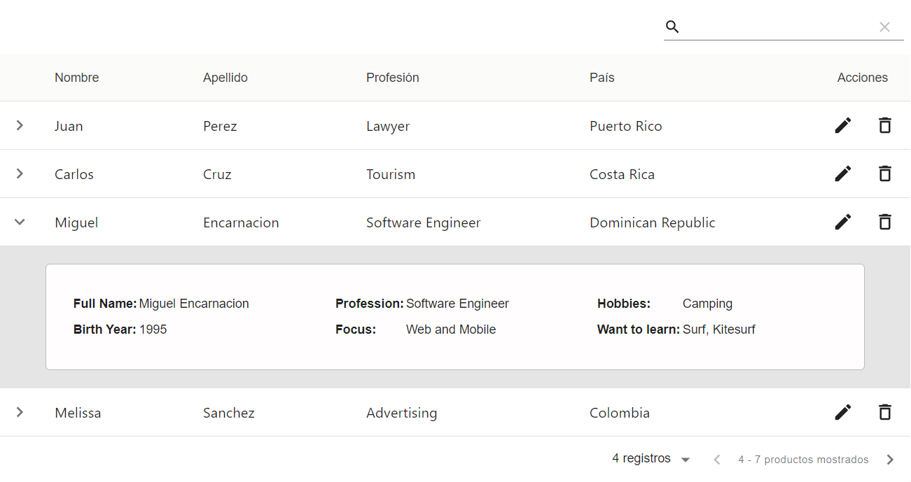

# Custom DataTable React Component

&nbsp;

## How to Use:

The component expects the following props:
|Prop Name|Type|Required|Description|
|--------|----|--|---|
|columns|Array|Yes|columns must be an array of objects with the structure: `{ title: '', field: '' }` where Title is what's shown in the column Header, and field is the name of the field needed for the Data object.|
|data|Array|Yes| data is an array of objects where the keys are called the same as the column's field, and the value can be strings or JSX elements.|
|editButton|Boolean|No|Determines if the Edit button is included|
|editFunction|Function|No|The Edit button action listener. This function receives an `event` and `rowData` parameter|
|deleteButton|Boolean|No|Determines if the Delete button is included|
|deleteFunction|Function|No|The Delete button action listener. This function receives an `event` and `rowData` parameter|
|expandPanel|Boolean|No|Determines if the Delete button is included|
|panelFunction|Function|No|The Delete button action listener. This function receives a `rowData` parameter|

&nbsp;

This project was created using [Material-Table](https://material-table.com/#/) and bootstrapped with [Create React App](https://github.com/facebook/create-react-app).

To run in development mode, run `npm start` and open [http://localhost:3000](http://localhost:3000) to view it in the browser.
